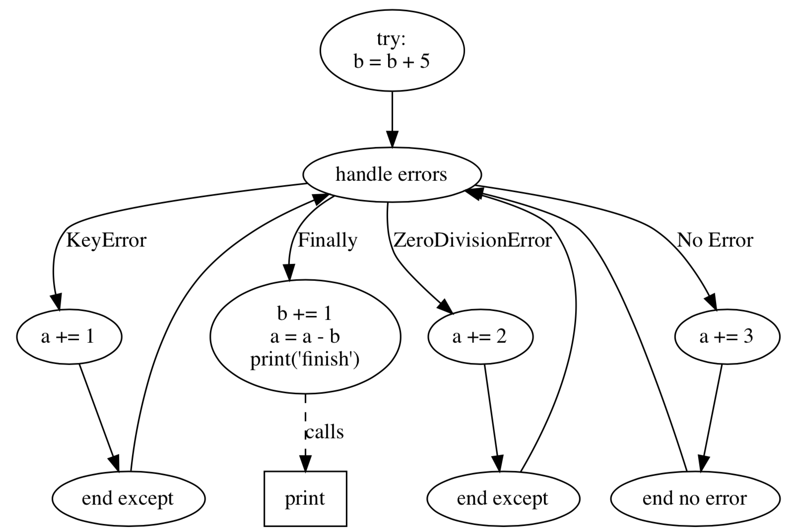
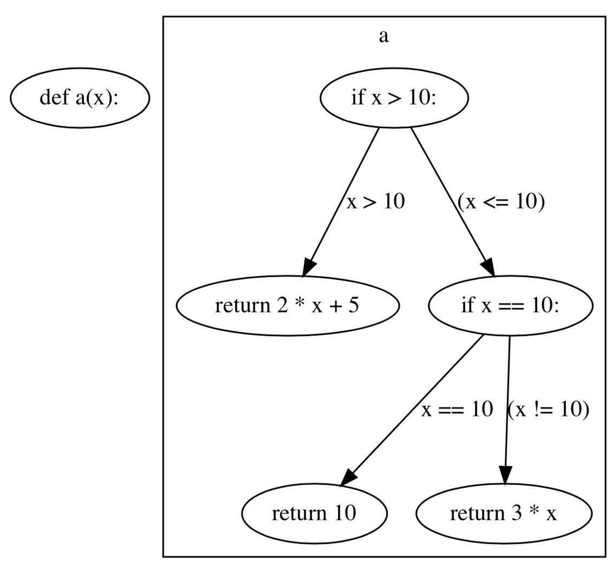
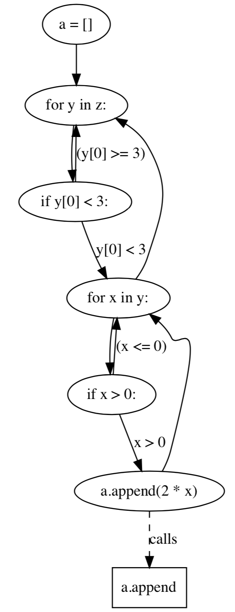
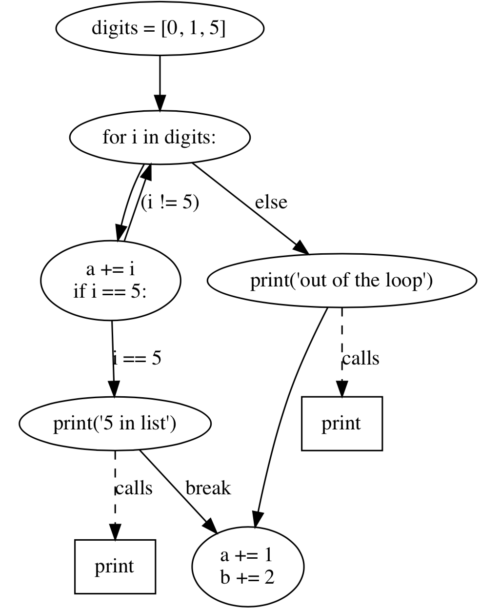

# Python Control Flow Graph Generator

A project to generate control flow graph for Python, written in Python3. The file cfg_orig.py is derived from [staticfg](https://github.com/coetaur0/staticfg) and is for comparison. cfg_orig.py has the exact same function as staticfg. cfg.py added support for 

- exception handling

- lambda expression

- generator expression

- list/set/dict comprehension

- for-else/while-else

- ... 

It also fixed some minor bugs in the original code.

# Dependencies

- Python3

- autopep8

- graphviz

- astor

# Usage

```python3 cfg.py code.py```

# Demo

### Try-Except-Else-Finally
```
try:
    b = b + 5
except KeyError:
    a += 1
except ZeroDivisionError:
    a += 2
else:
    a += 3
finally:
    b += 1
    a = a - b
    print('finish')
```


### Lambda Expression

```
a = lambda x: 2 * x + 5 if x > 10 else 10 if x == 10 else 3 * x
``` 


### List Comprehension
```
a = [2 * x for x in y if x > 0 for y in z if y[0] < 3]
```


### For-Else Statement
```
digits = [0, 1, 5]

for i in digits:
    a += i
    if i == 5:
        print("5 in list")
        break
else:
    print("out of the loop")

a += 1
b += 2
```
